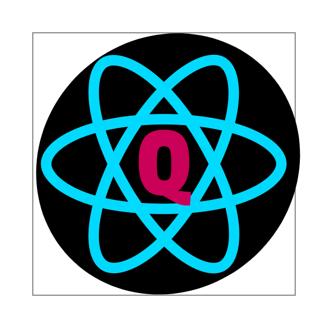

<!-- PROJECT LOGO -->
 

  

  <h3 align="center">Random Q&A Sessions on ReactJS</h3>

  

    Your daily dosages of react based on our daily basis work.
     
    <a href="https://github.com/anuja01/react-resources/blob/master/RandomQuestions.md"><strong>Explore the docs »</strong></a>
     
     
    <a href="https://github.com/anuja01/react-resources/issues">Report Issue</a>
    ·
    <a href="https://github.com/anuja01/react-resources/issues">Request Topic</a>
  

<!-- TABLE OF CONTENTS -->
## Table of Contents

* [About this Project](#about-the-project)
* [Getting Started](#getting-started)
  * [Prerequisites](#prerequisites)
* [Contributing](#contributing)
* [License](#license)
* [Contact](#contact)
* [Acknowledgements](#acknowledgements)

<!-- ABOUT THE PROJECT -->
## About The Project

This project is to log whatever the answers we found for our issues or questions we have during our daily basis work:
